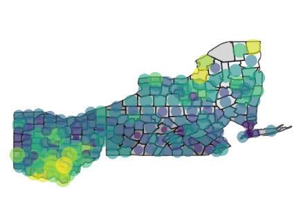
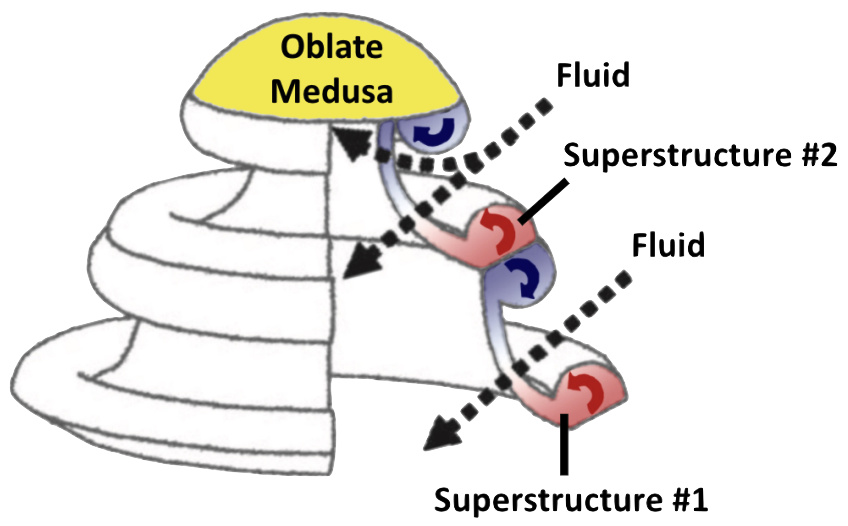

---
output:
  html_document:
    toc: false
---
## **Personal Favorites**
\
\

#### Match Registration Site Lead
Sep 2022 – Dec 2022\

* Delivered a [match queue registration system](https://www.youtube.com/watch?v=KFq0ex0oiKk) to accommodate the growing organization.
\
\

\

#### Chronic Disease Campaign Captain
Oct 2021 – Dec 2021\

* Analyzed the [impact of air quality and UV radiation](https://beeleeballin.github.io/p8105-final_project/) on chronic diseases in 4 US states.
\
\
\

\

#### Jelly Jet Propulsion Simulator
Sep 2019 – Dec 2020\

* Virginia Swinburne Brownell Prize <a href="images/thesis_abstract.pdf" target="_blank">Thesis</a>:\
        *Fluid Entrainment and Medusae Morphology Reveal Row Propulsion Proficiency*. 

* Modeled the [wake dynamics of medusae locomotion and feeding](https://github.com/beeleeballin/medusan_thrust).
* Presented at the Vassar Fall 2020 Life Sciences <a href="images/thesis_poster.pdf" target="_blank">Poster</a> Symposium.
\
\

## **SKILLS**
\

#### Proficient Coding Languages
Python / R / SQL / Bash
\
\

#### Platforms
Github / AWS / Postman / Spark / HPC / Conda
\
\

#### Statistics & Data Science
Inference / Graphical Models / Clustering / Regression / Simulation / Cross Validation / Imputation
\
\

#### Spoken Language
Mandarin Chinese (Native)

