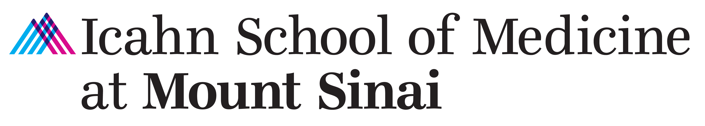

---
output:
  html_document:
    toc: false
---
\

\

#### Biostatistician I, Center for Biostatistics
Feb 2024 - Present\

\

#### Bioinformatician II, Bunyavanich Lab
Jul 2023 – Oct 2023\

* Modeled the association between gene methylation patterns of ~450K CpGs and allergic reaction severity to peanut using advanced statistical techniques.
* Published a [review](https://onlinelibrary.wiley.com/doi/10.1111/pai.14065) on the epigenomics of food allergy on Pediatric Allergy and Immunology
\
\

\

#### RA, Maniker Lab
Nov 2022 – May 2023\

* Analyzed and visualized [EPA rating trends](https://journals.lww.com/anesthesia-analgesia/abstract/9900/development_and_pilot_testing_of_a_programmatic.639.aspx) of ~500 anesthesiology residents at the university hospital.
\
\

\

#### RA, Wang Lab
May 2022 – May 2023\

* Compiled feature interaction networks from databases and [programmed](https://github.com/Karenxzr/MultiNEP) a published [graph-based tool](https://academic.oup.com/bioinformatics/article/39/6/btad333/7175421) for multi-ome signal prioritization.
* Led expanded model validation across lab projects by leveraging the newly available *All of Us* platform.
\
\

\

#### Lab Assistant, Protein Biochemistry Group
Mar 2021 – Jun 2021\

* Piloted a new sample request and delivery workflow; imported 30,000+ protein tubes into the BioBank to support company-wide studies.
* Used ELNs, LIMS, BioRegistry, and more to perform sample management in a timely and responsible manner.
* Appointed as an immediate respondent for Protein Biochemistry for urgent needs during pandemic protocols.
\
\

\

#### TA, Computer Science III - Software Design & Implementation
Sep 2020 – Dec 2020\

*	Designed and graded student assignments and lab work.
\
\
\
\

<!-- #### Student Researcher, Schwarz Lab -->
<!-- Mar 2020 – May 2020\ -->
<!-- • Modeled the functional impact and likelihood of probable CDS mutations in Nemostella hsp70 gene using Python and Swiss-Prot.\ -->
<!-- \ -->
<!-- \ -->
<!--  -->
<!-- #### Research Assistant, Wu Lab -->
<!-- Feb 2019 – Jun 2019\ -->
<!-- •	Increased the mrjp1 gene expression in A. mellifera to enhance the nutritional richness of royal jelly by 35%, a lab record\ -->
<!-- \ -->
<!-- \ -->